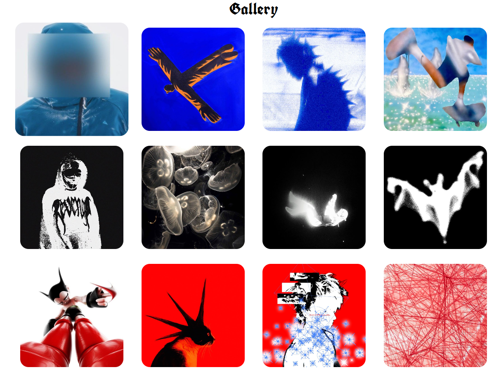

# WD-PRAC-3: Responsive image gallery using Grid and media queries (HTML and CSS).

## Description
This practice consists of a responsive image gallery designed using HTML and CSS. The gallery is organized by color themes:
- **Blue Column**
- **Black & White Column**
- **Red Column**

## Features
- Uses CSS Grid layout to align images in columns and maintain responsiveness. 
- Images are adjusted using appropriate **gap** properties.
- Images can scale up on hover for a better interactive experience. 

## Images
- Hover effect:

- Full page on different devices:

## Github 
[GitHub Repository](https://github.com/faiyamm/WD-PRAC-3)